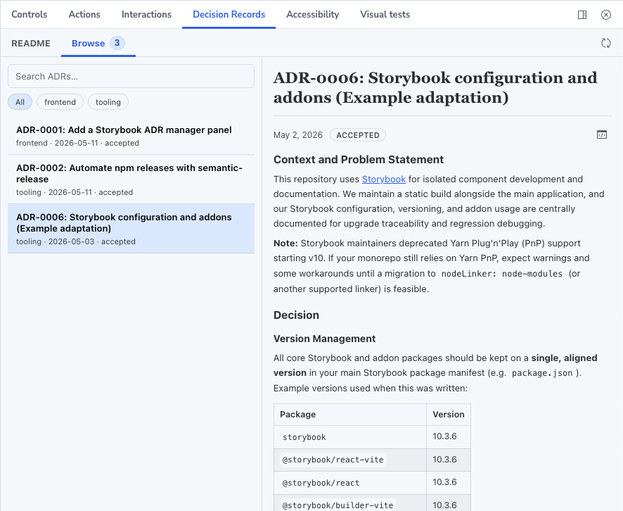

<div align="center">
  <picture style="display: flex; flex-direction: column; align-items: center;">
    
  </picture>

  <h1>Storybook Addon - Architecture Decision Records</h1>

This addon adds a **Decision Records** [panel](cleverb/storybook-addon-decision-records) for browsing ADR markdown files with category filters, full-text search, and story-tag-to-ADR matching.
  </p>
  <p>
    <a href="https://github.com/cleverb/storybook-addon-decision-records/commits"></a>
    <a href="https://github.com/cleverb/storybook-addon-decision-records/commits"></a>
    <a href="https://github.com/cleverb/storybook-addon-decision-records/issues/"></a>
    <a href="https://github.com/cleverb/storybook-addon-decision-records/graphs/contributors"></a>
    <a href="https://github.com/cleverb/storybook-addon-decision-records/blob/main/CODE_OF_CONDUCT.md"></a>
    <a href="https://github.com/cleverb/storybook-addon-decision-records/blob/main/LICENSE"></a>
    <a href="https://github.com/cleverb/storybook-addon-decision-records/network/members"></a>
    <a href="https://github.com/cleverb/storybook-addon-decision-records/stargazers"></a>
  </p>
</div>

---

## Table of Contents

<!-- no toc -->
- [Table of Contents](#table-of-contents)
- [Installation](#installation)
- [Features](#features)
- [Storybook configuration](#storybook-configuration)
- [Usage](#usage)
- [Contributing](#contributing)
  - [Code of Conduct](#code-of-conduct)
  - [Developer Certificate of Origin](#developer-certificate-of-origin)
  - [Getting Started](#getting-started)
  - [Useful commands](#useful-commands)
- [Migrating to a later Storybook version](#migrating-to-a-later-storybook-version)
- [Release System](#release-system)
- [Support](#support)
- [Contact](#contact)
- [Acknowledgments](#acknowledgments)
  - [Thanks](#thanks)
  - [Built With](#built-with)

## Installation

```bash
yarn add -D storybook-addon-decision-records
```

```bash
npm install -D storybook-addon-decision-records
```

```bash
pnpm install -D storybook-addon-decision-records
```

## Features

- Scans ADR markdown files from a configured root folder.
- Groups ADRs by category (subdirectory).
- Supports frontmatter (`title`, `status`, `date`) and fallback title extraction from `# Heading`.
- Lets tagged stories open directly on matching ADRs (`ADR-0001`, etc.).
- Generates `public/sb-adr-data.json` automatically during Storybook runs.


## Storybook configuration

In `.storybook/main.ts`:

```ts
import type { StorybookConfig } from '@storybook/react-vite';

const config: StorybookConfig = {
  staticDirs: ['../public'],
  addons: [
    {
      name: 'storybook-addon-decision-records',
      options: {
        adrRoot: './docs/decisions',
        categories: ['frontend', 'tooling'],
        indexReadmePath: './docs/decisions/README.md',
        tagMatchRegex: 'ADR-[0-9]+',
        panelLabel: 'Decision Records',
      },
    },
  ],
};

export default config;
```

## ADR folder convention

```text
docs/decisions/
  README.md
  frontend/
    ADR-0001-something.md
  tooling/
    ADR-0002-something-else.md
```

Example ADR file:

```md
---
status: accepted
date: 2026-05-11
title: Adopt storybook-addon-decision-records
---

# Adopt storybook-addon-decision-records

Context and decision details...
```

## Local development

```bash
pnpm install
pnpm start
```

`pnpm start` runs build watch + Storybook so the local add-on preset and manager entry stay up to date.

## Tests

```bash
pnpm test
pnpm test:coverage
```

Includes unit tests plus Storybook interaction test project via `@storybook/addon-vitest`.

## Build and publish es

```bash
pnpm build
pnpm pack
pnpm release
```

- `prerelease` runs metadata checks.
- `release` uses `semantic-release` and the GitHub/npm plugins from `release.config.js`.

## Repo layout

- `src/`: add-on source (preset, manager panel, scanning/parsing utilities)
- `.storybook/`: working local Storybook examples for add-on development
- `docs/decisions/`: sample ADR dataset used by local examples
- `scripts/prepublish-checks.js`: release safety checks


## 👩🏽‍💻 Contributing

### Code of Conduct

Please read the [Code of Conduct](https://github.com/cleverb/storybook-addon-decision-records/blob/main/CODE_OF_CONDUCT.md) first.

### Developer Certificate of Origin

To ensure that contributors are legally allowed to share the content they contribute under the license terms of this project, contributors must adhere to the [Developer Certificate of Origin](https://developercertificate.org/) (DCO). All contributions made must be signed to satisfy the DCO. This is handled by a Pull Request check.

> By signing your commits, you attest to the following:
>
> 1. The contribution was created in whole or in part by you and you have the right to submit it under the open source license indicated in the file; or
> 2. The contribution is based upon previous work that, to the best of your knowledge, is covered under an appropriate open source license and you have the right under that license to submit that work with modifications, whether created in whole or in part by you, under the same open source license (unless you are permitted to submit under a different license), as indicated in the file; or
> 3. The contribution was provided directly to you by some other person who certified 1., 2. or 3. and you have not modified it.
> 4. You understand and agree that this project and the contribution are public and that a record of the contribution (including all personal information you submit with it, including your sign-off) is maintained indefinitely and may be redistributed consistent with this project or the open source license(s) involved.

### Getting Started

This project uses PNPM as a package manager.

- See the [installation instructions for PNPM](https://pnpm.io/installation)
- Run `pnpm i`

### Useful commands

- `pnpm start` starts the local Storybook
- `pnpm build` builds and packages the addon code
- `pnpm pack` makes a local tarball to be used as a NPM dependency elsewhere
- `pnpm test` runs unit tests

### Migrating to a later Storybook version

If you want to migrate the addon to support the latest version of Storyboook, you can check out the [addon migration guide](https://storybook.js.org/docs/addons/addon-migration-guide).

### Release System

This package auto-releases on pushes to `main` with [semantic-release](https://github.com/semantic-release/semantic-release). No changelog is maintained and the version number in `package.json` is not synchronised.

## 🆘 Support

Please [open an issue](https://github.com/cleverb/storybook-addon-decision-records/issues/new) for bug reports or code suggestions. Make sure to include a working Minimal Working Example for bug reports.
## ✉️ Contact

Dudley Bryan · [LinkedIn](https://www.linkedin.com/in/dudleywb/)

Project Link: [https://github.com/cleverb/storybook-addon-decision-records](https://github.com/cleverb/storybook-addon-decision-records)

## 💛 Acknowledgments

### Thanks

- [Thomas Vaillancourt](https://github.com/thomvaill/log4brains) for his awesome work on Log4Brains, which helped get me into the idea of finding ways to make ADRs more integrated into frontend/agentic workflows
- All the contributors to the [Storybook addon kit](https://github.com/storybookjs/addon-kit)

### Built With

[](https://eslint.org/)
[](https://github.com/solutions/ci-cd)
[](https://prettier.io/)
[](https://github.com/semantic-release/semantic-release)
[](https://storybook.js.org/)
[](https://tsup.egoist.dev/)
[](https://www.typescriptlang.org/)
[](https://https://vitest.dev/)

## License

MIT
